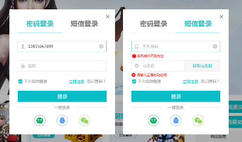
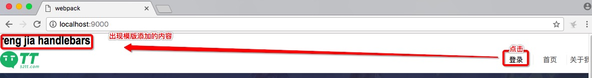

## 添加handlebars模版

### 优化需求

在弹出层中实现html标签，使用jquery来事项元素的拼凑的话，内容复杂的话，会出现容易拼错等问题，比如下面的登录弹出层：



### 优化方案

使用handlebars.

具体的信息可以参考下[handlebar官网](http://handlebarsjs.com/)。


### 使用方法

因为我这里是用`webpack`来进行项目的管理，我这里只是介绍使用webpack来使用handlebar。

1.加载依赖

`npm install --save-dev handlebars`

`npm install --save-dev handlebars-loader`

2.build --> webpack.base.config.js 中处理`.handlebas`后缀文件

```javascript

    ...
    module:{ //处理项目中的不同的模块
        rules:[
            ...
            {//处理handlebar
                test:/\.handlebars$/,
                use:[
                    {loader:"handlebars-loader"}
                ]
            }
            ...
        ]
    },
    ...

```

3.添加示例的文件 js --> common --> handlebars --> login.handlesbars

我这里随便添加了些内容

```html

<h1 id="login">
    <p>{{name}}</p>
</h1>


```

4.在相关的使用到的模块中引入

我这里的测试的模块是首页index.html，所以我在相关的 `src --> js --> index.js`中引入下面的内容：

```javascript

var loginTpl = require("../handlebars/login.handlebars");

$("#login").click(function(){
    var div = document.createElement("div");
    div.innerHTML = loginTpl({
        name:"reng jia handlebars"
    });
    $("body").prepend(div);
});

```

这样子我点击首页的登录的按钮（id为login），就会在页面的顶部添加创建的内容:点击后的效果如图：



至此，已经解决了相关的handlebars模版的问题。


### 参考链接

[handlebars官网](http://handlebarsjs.com/)

[pcardune/handlebars-loader](https://github.com/pcardune/handlebars-loader)


